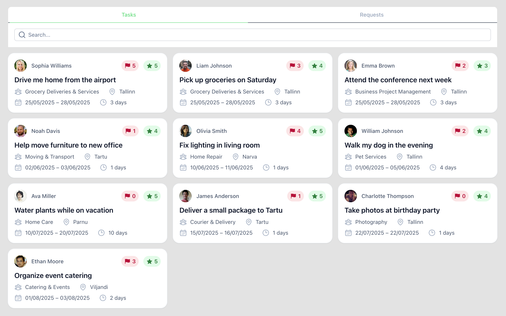
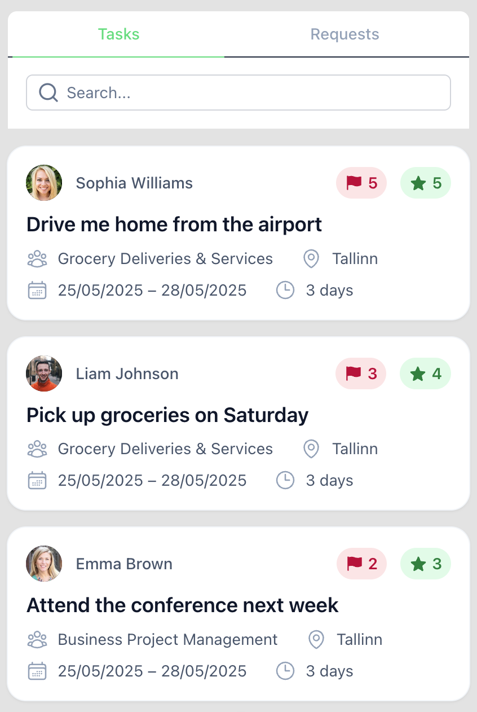

# Ad Management Application

A modern, offline-capable Vue.js application for managing advertisements.

## 🚀 Features

- ✅ **Ad Management**: View ads
- 🔍 **Search & Filtering**: Filtering by search
- 📱 **Responsive Design**: Mobile-first with desktop breakpoint
- 🔌 **Offline Support**: Full PWA with offline functionality
- 🎨 **Modern UI**: Built with Nuxt UI v4 and Tailwind CSS
- ⚡ **Performance**: Optimized with Nuxt 4

## 📸 Screenshots

### Desktop View



### Mobile View



## 🛠️ Tech Stack

- **Framework**: Nuxt 4
- **UI Framework**: Nuxt UI v4
- **Language**: TypeScript
- **Styling**: Tailwind CSS
- **State Management**: Pinia
- **PWA**: Vite PWA Plugin

## 📦 Installation

```bash
# Clone the repository
git clone https://github.com/Farrux02/advertisement-app

# Navigate to project directory
cd advertisement-app

# Install dependencies
npm install

# Run development server
npm run dev
```

## 🏗️ Project Structure

```
ad-management-app/
├── app/
│   ├── modules/
│   │   ├── advertisement/
│   │   │   ├── components/
│   │   │   │   ├── AdCard.vue
│   │   │   ├── ad.types.ts
│   │   │   ├── index.ts
│   ├── pages/
│   │   ├── index.vue
│   ├── shared/
│   │   ├── components/
│   │   │   ├── filter/
│   │   │   │   ├── Filter.vue
├── nuxt.config.ts
└── tsconfig.json
```